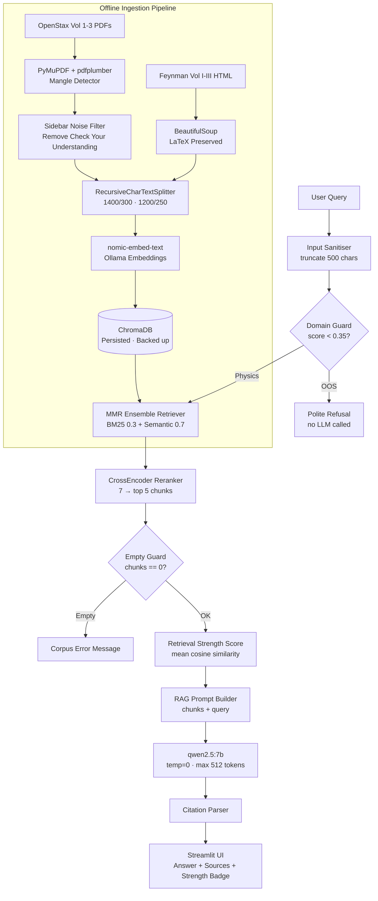

An offline, local Retrieval-Augmented Generation...
# 🔭 Local Physics RAG Chatbot

An offline, local Retrieval-Augmented Generation (RAG) system acting as an undergraduate-level physics tutor. Powered by **Ollama (`qwen2.5:7b` + `nomic-embed-text`)**, **LangChain**, **ChromaDB**, and **Streamlit**.

The corpus consists of **OpenStax University Physics Volumes 1–3** (PDFs) and **The Feynman Lectures on Physics Volumes I–III** (HTML scraped with preserved LaTeX math).

---

## 🏗️ Architecture



---

## 🛠️ Installation & Setup

### 1. Prerequisites
- **Python 3.10 or 3.11**
- **Ollama** installed on your machine.
- Pull the required local models:
  ```bash
  ollama pull qwen2.5:7b
  ollama pull nomic-embed-text
  ```

### 2. Setup Virtual Environment
Clone this repository and create a virtual environment:
```bash
python -m venv venv
.\venv\Scripts\Activate.ps1   # On Windows
pip install -r requirements.txt
```

### 3. Set up Environment Variables
Copy the template `.env.example` to `.env` (if custom configurations like `OLLAMA_HOST` are needed):
```bash
cp .env.example .env
```

---

## 📥 Ingestion & Scraping

To populate the local database, run the following steps in sequence:

### 1. Download OpenStax PDFs
Downloads University Physics Volumes 1–3 dynamically by crawling the latest high-resolution PDF links:
```bash
python scripts/download_corpus.py
```

### 2. Scrape Feynman Lectures
Extracts all 115 chapters of The Feynman Lectures on Physics with mathematical LaTeX inline equations preserved:
```bash
python scripts/feynman_scraper.py
```

### 3. Ingest Into ChromaDB
Parses, splits, filters sidebar noise, hashes document IDs (for idempotency), generates embeddings, and saves the vector store + BM25 indices:
```bash
python src/ingest.py
```
*Note: Ingestion checkpoints are saved every 500 chunks. If the pipeline is interrupted, re-running it will automatically resume from the last saved state.*

---

## 🚀 Running the Web Application

Launch the Streamlit UI dashboard:
```bash
streamlit run app.py
```
Open `http://localhost:8501` in your browser.

---

## 🧪 Evaluation & Hallucination Test Suite

The test suite evaluates the RAG system parameters (Retrieval Precision@5, Recall@5, Citation Accuracy, OOS Refusal Rate) and compares them against a bare LLM baseline.

### 1. Run Baseline (Bare LLM)
Queries the 18 physics questions directly on `qwen2.5:7b` without context:
```bash
python tests/baseline_runner.py
```

### 2. Run Hallucination & Retrieval Suite
Evaluates the RAG system and compares metrics side-by-side:
```bash
python tests/hallucination_suite.py --report --baseline
```
Detailed execution reports are saved to `tests/results/report_YYYYMMDD.json`.

---

## 🐳 Containerised Deployment

To deploy both Ollama and the RAG app together using Docker:
```bash
docker-compose up -d
# Once started, download models in the Ollama container:
docker exec -it physics-ollama ollama pull qwen2.5:7b
docker exec -it physics-ollama ollama pull nomic-embed-text
```
Access the application at `http://localhost:8501`.

---

## ⚠️ Important Considerations & Design Decisions

### 1. Retrieval Strength vs. Confidence
- The **Retrieval Strength** badge shown in the UI (calculated as the mean cosine similarity of top-K reranked chunks) is a **proxy metric of retrieval relevance**.
- It is **not** a calibrated probability of the answer's factual correctness. The UI clearly states this in tooltips to maintain transparency.

### 2. Concurrency & Performance
- **Single-User Scope**: Streamlit is single-threaded; streaming responses lock the user input field to prevent browser freezes.
- **Hardware Limitations**: Re-ranking and embedding models run locally on consumer GPUs. For simultaneous multi-user demonstrations, VRAM overflows can occur if parallel requests are served by Ollama (which defaults to queueing them).

### 3. LaTeX Equation Degradation
- PDFs can contain complex vector formatting that mangles equations when extracted. The ingestion pipeline uses a **three-layer parsing strategy** (PyMuPDF $\rightarrow$ mangle detection $\rightarrow$ pdfplumber fallback).
- Chunks that fail the mangle test are still indexed, but their citations in the UI are flagged with a `⚠️ Degraded Equations` badge to notify the user.
